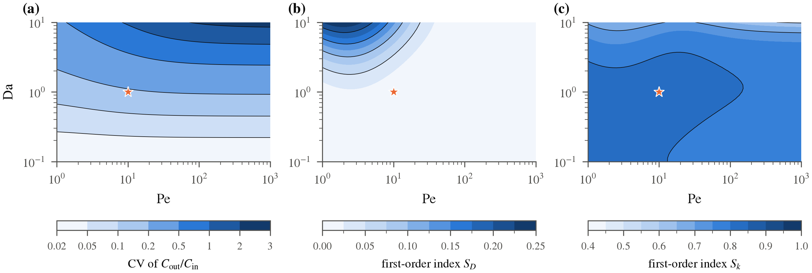

# Verification and Uncertainty Quantification in Axial-Dispersion Reactor Models

Computational companion to the manuscript:

> **A. Alsammani, M. A. Y. Mohammed, and A. Ali**, *Verification and Uncertainty Quantification in Axial-Dispersion Reactor Models*.

This repository contains the Python implementation, Jupyter notebooks, numerical tests, computational results, and figures supporting the study. The workflow is designed to reproduce the numerical experiments from a clean Python environment.

**The manuscript itself is not included in this repository.**



---

## Scientific Overview

The axial-dispersion model provides a one-dimensional description of transport and reaction in non-ideal tubular reactors. Predictions obtained from this model are affected by several distinct sources of uncertainty and error:

- uncertainty in physical and kinetic parameters;
- numerical discretization error;
- sampling error in Monte Carlo estimation;
- random measurement noise; and
- systematic sensor offsets.

This project treats these sources separately. We first verify the numerical solver against analytical and manufactured benchmarks. We then propagate parametric uncertainty through the verified model, quantify variance-based sensitivity using Sobol' indices, compare Monte Carlo (MC) and randomized quasi-Monte Carlo (RQMC) estimators using identical input distributions, and investigate the effects of measurement error on parameter inference.

---

## Mathematical Model

For the concentration \(C(x,t)\) in a reactor of length \(L\), with constant axial velocity \(u\), axial-dispersion coefficient \(D\), and first-order reaction rate constant \(k\),

The closed–closed Danckwerts boundary conditions are

$$
uC(0^+,t)-D\,\partial_x C(0^+,t)
=
uC_{\mathrm{in}}(t),
\qquad
\partial_x C(L,t)=0.
$$

The principal dimensionless groups are the Péclet and Damköhler numbers,

$$
\mathrm{Pe}=\frac{uL}{D},
\qquad
\mathrm{Da}=\frac{kL}{u}.
$$

The principal dimensionless groups are the Péclet and Damköhler numbers,

\[
\mathrm{Pe}=\frac{uL}{D},
\qquad
\mathrm{Da}=\frac{kL}{u}.
\]

For the steady problem, the outlet-to-inlet concentration ratio is given by the Wehner–Wilhelm expression

\[
\frac{C(L)}{C_{\mathrm{in}}}
=
\frac{4q\,e^{\mathrm{Pe}/2}}
{(1+q)^2e^{q\mathrm{Pe}/2}
-(1-q)^2e^{-q\mathrm{Pe}/2}},
\qquad
q=\sqrt{1+\frac{4\mathrm{Da}}{\mathrm{Pe}}}.
\]

---

## Computational Framework

The computational study combines numerical verification, uncertainty quantification, sensitivity analysis, randomized sampling, and synthetic measurement-error experiments.

| Component | Method |
|---|---|
| **Spatial discretization** | Cell-centered finite-volume method with central advective fluxes; first-order upwind fluxes are available for comparison |
| **Boundary treatment** | Danckwerts inlet imposed through the boundary flux \(F_0=uC_{\mathrm{in}}\), with a zero-gradient outlet condition |
| **Time integration** | \(\theta\)-method with Crank–Nicolson for production calculations and backward/forward Euler for comparison |
| **Stability analysis** | Von Neumann analysis of centered explicit FTCS with reaction and discrete stability analysis of the finite-volume formulation |
| **Verification** | Analytical benchmarks, conservation checks, transfer-function moments, and manufactured-solution convergence studies |
| **Forward UQ** | Log-normal uncertainty in \(u\), \(D\), \(k\), and \(C_{\mathrm{in}}\) |
| **Sampling** | Standard Monte Carlo and scrambled Sobol' randomized quasi-Monte Carlo |
| **Sensitivity** | First-order and total Sobol' sensitivity indices and Pe–Da regime analysis |
| **Measurement error** | Synthetic observation model \(y=C+b+\varepsilon\), with systematic offset \(b\) and Gaussian random error \(\varepsilon\) |
| **Inference** | Synthetic inverse problems for kinetic and transport parameters with uncertainty and coverage assessment |

---

## Main Computational Findings

For the baseline case

$$
\mathrm{Pe}=10,
\qquad
\mathrm{Da}=1,
$$

the computational experiments give the following principal results.

### Numerical verification

The finite-volume implementation exhibits second-order global convergence in space and time for the smooth verification problems considered. The discrete mass balance is satisfied to numerical precision.

Centered explicit FTCS is unstable for pure advection. For advection–dispersion without reaction, the classical stability restriction is

$$
\beta^2\leq 2\alpha\leq 1,
$$

with the admissible region modified when first-order reaction is included.

### Parametric uncertainty

Under the assumed input distributions, the exit concentration has a coefficient of variation of approximately **19.1%**.

Representative first-order Sobol' indices for the exit concentration are approximately:

| Parameter | First-order Sobol' index |
|---|---:|
| Rate constant \(k\) | 0.75 |
| Velocity \(u\) | 0.17 |
| Feed concentration \(C_{\mathrm{in}}\) | 0.07 |
| Dispersion coefficient \(D\) | 0.01 |

These results indicate that reaction kinetics dominate uncertainty in the baseline exit concentration, while the relative importance of dispersion changes across transport and reaction regimes.

### Monte Carlo versus RQMC

For the smooth, four-dimensional uncertainty-propagation problems considered here, RQMC mean-estimation errors exhibit empirical convergence rates of approximately

$$
n^{-1.07}\ \text{to}\ n^{-1.17},
$$

compared with the expected \(n^{-1/2}\) behavior of standard Monte Carlo.

At \(n=4096\), the observed mean-squared-error ratios favor RQMC by approximately

$$
2.2\times10^4
\quad\text{to}\quad
6.4\times10^4.
$$

These are empirical results for the specific smooth, low-dimensional problems studied here and should not be interpreted as universal RQMC performance guarantees.

### Measurement error

In the synthetic transient inverse problem, ignoring a systematic sensor offset equal to approximately **1.5% of the peak signal** biases the fitted rate constant by approximately **−3.3%** and reduces nominal 95% confidence-interval coverage to approximately **0.11**.

Including the offset in the observation model restores near-nominal coverage.

> **Important:** All observations used in the measurement-error experiments are synthetic, and the input distributions are assumed for methodological illustration. No experimental validation of a specific reactor system is claimed.

---

## Repository Structure

```text
pfr-uncertainty-quantification/
├── figures/
│   ├── fig01_model_schematic.png
│   ├── fig02_ftcs_stability.png
│   ├── fig03_verification.png
│   ├── fig04_convergence.png
│   ├── fig05_transport_regimes.png
│   ├── fig06_parametric_uq.png
│   ├── fig07_regime_uq.png
│   ├── fig08_mc_qmc.png
│   └── fig09_measurement_error.png
│
├── notebooks/
│   ├── 01_model_verification.ipynb
│   ├── 02_numerical_validation.ipynb
│   ├── 03_uncertainty_analysis.ipynb
│   └── 04_publication_figures.ipynb
│
├── results/
│   ├── data/
│   ├── tables/
│   └── final_results.json
│
├── src/
│   ├── pfr_uq/
│   └── pfr_uq.egg-info/
│
├── tests/
│   ├── __pycache__/
│   └── test_core.py
│
├── tools/
│   ├── __pycache__/
│   ├── build_reference_audit.py
│   ├── crossref_lookup.py
│   ├── fix_latexdiff.py
│   ├── run_all.py
│   └── verify_references.py
│
├── CITATION.cff
├── LICENSE
├── README.md
├── pyproject.toml
└── requirements.txt
```

The structure above reflects the current repository contents. Generated Python cache and package-metadata directories such as `__pycache__/` and `*.egg-info/` are not required for reproducibility and may be removed from future releases.

---

## Figures

The `figures/` directory contains the nine figures associated with the computational study:

| Figure | File | Content |
|---|---|---|
| 1 | `fig01_model_schematic.png` | Axial-dispersion reactor model schematic |
| 2 | `fig02_ftcs_stability.png` | Explicit FTCS stability analysis |
| 3 | `fig03_verification.png` | Numerical verification results |
| 4 | `fig04_convergence.png` | Spatial and temporal convergence |
| 5 | `fig05_transport_regimes.png` | Transport-regime behavior |
| 6 | `fig06_parametric_uq.png` | Parametric uncertainty quantification |
| 7 | `fig07_regime_uq.png` | Uncertainty across the Pe–Da regime |
| 8 | `fig08_mc_qmc.png` | MC versus RQMC comparison |
| 9 | `fig09_measurement_error.png` | Measurement-error and inference experiments |

The figures are generated from the computational workflow rather than manually edited numerical results.

---

## Jupyter Notebooks

The computational workflow is organized into four notebooks.

### `01_model_verification.ipynb`

Contains mathematical and computational checks associated with the governing model and numerical formulation, including stability and verification calculations.

### `02_numerical_validation.ipynb`

Contains numerical benchmarks, convergence studies, manufactured-solution tests, and production-resolution validation.

### `03_uncertainty_analysis.ipynb`

Contains the principal uncertainty-quantification calculations, including:

- forward parametric UQ;
- MC/RQMC comparisons;
- Sobol' sensitivity analysis;
- Pe–Da regime calculations;
- measurement-error experiments; and
- synthetic parameter-inference studies.

### `04_publication_figures.ipynb`

Generates the final computational figures and consolidated numerical outputs used to summarize the study.

For reproducibility, the notebooks should be executed in numerical order.

---

## Installation

Clone the repository:

```bash
git clone https://github.com/aalsammani/pfr-uncertainty-quantification.git
cd pfr-uncertainty-quantification
```

Create a virtual environment:

```bash
python -m venv .venv
```

### Windows

Activate the environment with:

```bash
.venv\Scripts\activate
```

### macOS/Linux

Activate the environment with:

```bash
source .venv/bin/activate
```

Upgrade `pip` and install the required dependencies:

```bash
python -m pip install --upgrade pip
python -m pip install -r requirements.txt
```

The Python dependencies required by the computational workflow are specified in `requirements.txt`.

> **Windows:** Cloning the repository to a relatively short local path is recommended to reduce the risk of Windows path-length problems during package installation.

---

## Running the Tests

Run the automated test suite from the repository root:

```bash
python -m pytest -q
```

The primary test implementation is located at

```text
tests/test_core.py
```

and is intended to check key components of the numerical implementation.

---

## Reproducing the Computational Study

The repository includes the workflow driver

```text
tools/run_all.py
```

which can be executed from the repository root:

```bash
python tools/run_all.py
```

The notebooks can also be opened in Jupyter and executed individually in the following order:

```text
01_model_verification.ipynb
02_numerical_validation.ipynb
03_uncertainty_analysis.ipynb
04_publication_figures.ipynb
```

Using a fresh kernel for each notebook is recommended when independently reproducing the calculations.

---

## Random-Number Reproducibility

The computational experiments use a documented master seed:

```text
20261002
```

Random streams are generated reproducibly through NumPy's random-number infrastructure.

This enables repeated runs of the stochastic and randomized computational experiments under the same documented configuration.

---

## Results

Generated computational results are stored under

```text
results/
```

with the current structure

```text
results/
├── data/
├── tables/
└── final_results.json
```

### `results/data/`

Contains generated numerical data supporting the computational experiments.

### `results/tables/`

Contains machine-readable tabular results.

### `results/final_results.json`

Contains the consolidated numerical results generated by the computational workflow.

This JSON file provides a machine-readable record of the principal quantities reported by the study.

---

## Utility Scripts

The `tools/` directory currently contains:

```text
tools/
├── build_reference_audit.py
├── crossref_lookup.py
├── fix_latexdiff.py
├── run_all.py
└── verify_references.py
```

`run_all.py` provides the main workflow utility.

The remaining scripts support reference checking, bibliographic auditing, and development tasks associated with the project.

Some utility scripts reflect the broader development workflow and are not required for ordinary use of the numerical package.

---

## Reproducibility Principles

The repository is organized around the following reproducibility principles:

1. **Source-controlled numerical implementation**  
   The governing model, numerical methods, and uncertainty calculations are implemented in Python.

2. **Executable research record**  
   The Jupyter notebooks document the major computational stages of the study.

3. **Automated testing**  
   Numerical components are checked through the `pytest` test suite.

4. **Machine-readable results**  
   Generated quantities are retained in structured data files rather than only appearing in figures.

5. **Programmatic figures**  
   Figures are generated computationally from the underlying numerical results.

6. **Documented dependencies**  
   Required Python packages are specified in `requirements.txt` and project metadata are provided in `pyproject.toml`.

7. **Reproducible random streams**  
   Randomized calculations use a documented master seed.

---

## Scope and Limitations

This repository supports a computational study based on a one-dimensional, isothermal axial-dispersion model with constant transport coefficients and first-order kinetics.

The uncertainty distributions are assumed for methodological illustration rather than estimated from experimental reactor data.

The measurement-error experiments use synthetic observations. Consequently, the repository demonstrates numerical verification, uncertainty propagation, sensitivity analysis, sampling behavior, and statistical effects of measurement error under controlled computational conditions.

It does **not** constitute experimental validation of a particular reactor system.

The reported RQMC convergence rates and efficiency gains are empirical findings for the smooth, low-dimensional problems considered in this study and should not be interpreted as universal performance guarantees.

---

## Citation

Citation metadata for this repository are provided in [`CITATION.cff`](CITATION.cff).

If you use the software, computational workflow, or results from this repository, please cite the associated manuscript once its final publication information becomes available.

A permanent archived software release and DOI may be provided following publication.

---

## License

The software and computational materials in this repository are distributed under the terms specified in [`LICENSE`](LICENSE).

Please consult the license file for permissions and conditions governing reuse, modification, and redistribution.

---

## Authors

**Abdallah Alsammani**  
Department of Mathematical Sciences  
Delaware State University  
Dover, Delaware, USA

**Mohammed A. Y. Mohammed**  
Department of Mathematics and Statistics  
Georgia State University  
Atlanta, Georgia, USA

**Alsadig Ali**  
Department of Mathematics  
Hampton University  
Hampton, Virginia, USA

---

## Contact

For questions concerning the computational implementation or reproducibility, contact:

**Abdallah Alsammani**  
Department of Mathematical Sciences  
Delaware State University  
Dover, Delaware, USA  
Email: aalsammani@desu.edu
